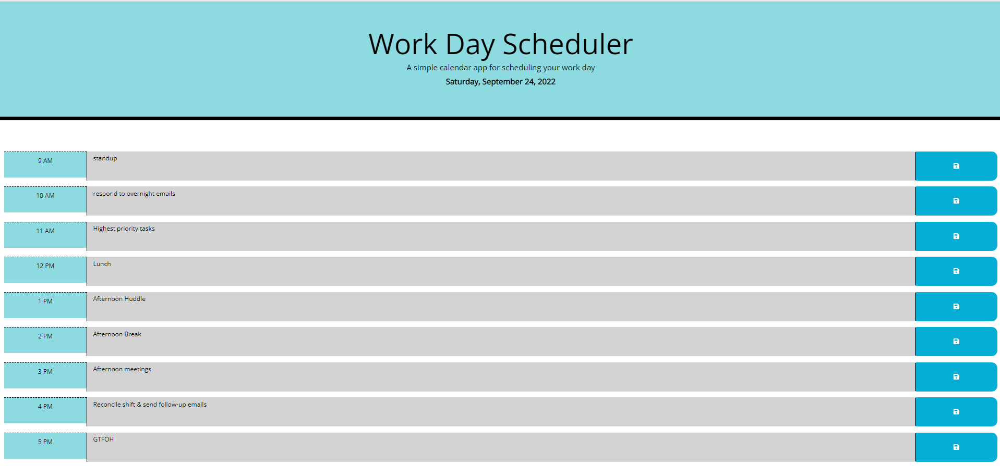

# Day Planner
An interactive day scheduler that allows the user to schedule events during each 1 hour block of the workday.

## Developer Info  
- Developed by Karl Linfeldt  
- [Github Repo](https://github.com/KarlOL82/day_planner)  
- [email](klinfeldt@gmail.com)  

## User Story  
AS AN employee with a busy schedule
I WANT to add important events to a daily planner
SO THAT I can manage my time effectively  

## Overview  
This application allows the user to schedule their work day by adding notes to each one hour block of time. The notes are saved in local storage and rendered in the browser. The time blocks are color coded based on whether each hour is in the past, present, or future and are updated once per minute. The application was built using Javascript, Jquery, html, and CSS and deployed with Github Pages.  

## License  
  
  https://opensource.org/licenses/MIT  

  This application is using the MIT license. 

## Screenshot

